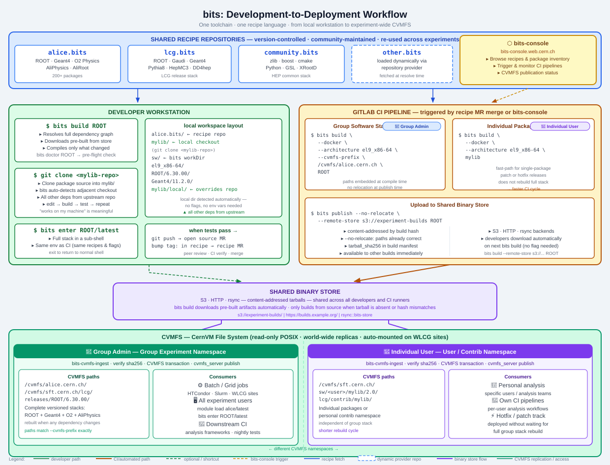

# bits Workflow Guide

This document describes the complete bits development-to-deployment workflow — from a first local build on a developer's workstation through group-wide CI and final publication to CVMFS.

---

## Overview



The diagram above captures the full picture. The key insight is that **a single, shared toolchain connects every developer's laptop to the experiment's CVMFS software repository**. There is no separate "local build system" and "CI build system". Every phase of a package's lifecycle — from the first `./configure` on your workstation to the CVMFS transaction that makes the software available to thousands of grid jobs — runs the same `bits build` command against the same recipes.

The following sections walk through the workflow phase by phase.

---

## Phase 1 — Local setup from shared recipes

Everything starts by cloning the community recipe repository and letting bits build the full software stack for your platform:

```bash
git clone https://github.com/bitsorg/alice.bits.git
cd alice.bits
bits build ROOT        # resolves the dependency graph and builds everything
bits enter ROOT/latest # opens a sub-shell with the environment loaded
```

Bits resolves the complete dependency graph, downloads sources, and compiles in the right topological order. Because the recipe repository is shared across the whole group, every developer and every CI runner starts from the same definition of "the full stack". There is no per-person or per-machine configuration that can silently diverge.

Remote binary stores ([§21 of REFERENCE.md](REFERENCE.md#21-remote-binary-store-backends)) mean that pre-built artifacts are downloaded when available and a local build is only triggered for packages that are missing or have changed. The first `bits build` on a fresh workstation typically takes a few minutes for the last few packages and seconds for everything else.

Multiple recipe repositories can be composed. For example, `alice.bits` builds the ALICE software stack on top of packages from `lcg.bits` (the LHC Computing Grid release stack) and `community.bits` (HEP common libraries). The [repository provider feature](REFERENCE.md#13-repository-provider-feature) lets bits load additional recipe repos dynamically at dependency-resolution time, with no manual configuration required.

---

## Phase 2 — Local development mode

Suppose you want to modify `mylib`. Clone the source repository next to your recipe checkout:

```bash
# clone the package source alongside the recipe repo
git clone https://github.com/example/mylib.git

# now build — bits detects the local checkout automatically
bits build mylib
```

**How local mode works.** When `bits build` resolves the dependency graph it scans for directories adjacent to (or below) the recipe checkout that have the same name as a package. If it finds one it treats that directory as the source for that package instead of fetching from the upstream remote. All other packages in the graph continue to be resolved from the upstream recipe repository, so `mylib` is compiled against the exact same versions of ROOT, Geant4, and everything else that CI uses. The local override is transparent: there is no flag to pass, no environment variable to set, and no copy of the recipe to edit.

```
alice.bits/       ← recipe repo (bits looks here for recipes)
mylib/            ← local source checkout (bits detects and uses this automatically)
sw/               ← bits workDir (output of all builds)
  el9_x86-64/
    ROOT/6.30.00/
    Geant4/11.2.0/
    mylib/local/  ← your build, overrides any upstream version
```

Because the build environment — compiler, flags, dependency versions — is identical to CI, a package that builds and passes tests locally will behave the same in CI. **"Works on my machine" is a meaningful guarantee**, not a lucky coincidence.

---

## Phase 3 — Full-stack local testing

With the local checkout in place you have a full, runnable software stack on your workstation. You can run the experiment software, integration tests, or any interactive workflow:

```bash
bits build ROOT                    # rebuilds ROOT with the updated mylib
bits enter ROOT/latest             # full stack available in a sub-shell
root -b -q 'myAnalysis.C'         # runs against your locally built mylib
```

You can also verify that the package builds correctly inside the same Docker image that CI will use, without leaving your workstation:

```bash
bits build --docker --architecture el9_x86-64 mylib
```

This spins up the official builder container, bind-mounts the current directory (including the local `mylib/` checkout), and runs the build inside it. If this succeeds, CI will succeed for the same reason.

---

## Phase 4 — Commit and share

When local testing passes you push the source changes to the package repository and update the recipe to point at the new commit or tag:

```bash
# In mylib/ — commit and push the source changes
cd mylib
git commit -am "Fix the covariance matrix initialisation"
git push origin my-fix-branch

# Back in alice.bits/ — update the recipe tag/commit
cd ../alice.bits
# Edit mylib.sh: update `tag:` or `commit:` field to the new revision
bits doctor mylib                  # verify the recipe is consistent
git commit -am "mylib: bump to my-fix-branch"
git push
```

Opening a merge request on the recipe repository initiates the standard peer-review cycle. Other developers can check out your recipe branch and run `bits build mylib` to reproduce the build themselves before approving.

---

## Phase 5 — CI build and CVMFS publication

Once the recipe MR is merged, a GitLab CI pipeline takes over. Bits supports two distinct publication paths, which result in packages landing on CVMFS in **different namespaces** depending on who triggers the build and what kind of publication is intended.

### Group Admin path — group software stack

A group administrator (or a pipeline triggered via [bits-console](REFERENCE.md#bits-console--web-interface-for-the-gitlab-driven-pipeline)) builds the full experiment software stack:

```bash
bits build --docker \
           --architecture el9_x86-64 \
           --cvmfs-prefix /cvmfs/alice.cern.ch \
           ROOT

bits publish --no-relocate \
             --remote-store s3://experiment-builds \
             ROOT
```

The `--cvmfs-prefix` flag mounts the workDir inside the container at the final CVMFS installation path, so compiled-in paths already match the deployment location. `--no-relocate` on `bits publish` skips the relocation step that would otherwise be needed.

The resulting tarballs are uploaded to the shared binary store, ingested by the CVMFS stratum-0, and published to the **group experiment namespace**:

```
/cvmfs/alice.cern.ch/        ← ALICE group stack
/cvmfs/sft.cern.ch/lcg/      ← LCG release stack
```

This namespace is available experiment-wide: to every developer's `bits enter` session, to batch grid jobs at WLCG sites, and to downstream CI pipelines.

### Individual User path — single-package publication

An individual developer can publish a single package independently of the full group stack rebuild cycle:

```bash
bits build --docker \
           --architecture el9_x86-64 \
           mylib

bits publish --remote-store s3://experiment-builds mylib
```

The resulting package lands in a **separate namespace** on CVMFS:

```
/cvmfs/sft.cern.ch/sw/<user>/mylib/2.0/
/cvmfs/sft.cern.ch/lcg/contrib/mylib/
```

This path is independent of the group stack. Consumers — specific users, analysis teams, or per-user CI pipelines — can access the package without waiting for a full group stack rebuild. This is the natural path for patch releases and hotfixes.

### End-to-end summary

```
Developer workstation        Shared GitLab CI                    CVMFS
────────────────────────────────────────────────────────────────────────
git clone <mylib-repo>       bits build --docker                 CVMFS transaction
  ↓ edit & test locally        --cvmfs-prefix /cvmfs/...           ↓
bits build mylib               ROOT                            available to all
  ↓ full-stack verified      bits publish --no-relocate          (group namespace)
git push + recipe MR           ROOT → s3://experiment-builds
  ↓ peer review              ↓                               OR
MR merged                    bits build --docker mylib
                               bits publish mylib              (user namespace)
```

**bits-console** provides a browser interface for triggering and monitoring these CI pipelines without leaving your web browser, and for browsing the published package inventory on CVMFS. See [§26 of REFERENCE.md](REFERENCE.md#26-cvmfs-publishing-pipeline) for the full pipeline documentation.

---

## Related documentation

| Topic | Location |
|-------|----------|
| Full command reference (`bits build`, `bits publish`, …) | [REFERENCE.md §16](REFERENCE.md#16-command-line-reference) |
| Docker builds and `--cvmfs-prefix` | [REFERENCE.md §22](REFERENCE.md#22-docker-support) |
| Remote binary store backends (S3, HTTP, rsync) | [REFERENCE.md §21](REFERENCE.md#21-remote-binary-store-backends) |
| Repository provider feature | [REFERENCE.md §13](REFERENCE.md#13-repository-provider-feature) |
| CVMFS publishing pipeline & bits-cvmfs-ingest | [REFERENCE.md §26](REFERENCE.md#26-cvmfs-publishing-pipeline) |
| bits-console web interface | [REFERENCE.md §26](REFERENCE.md#bits-console--web-interface-for-the-gitlab-driven-pipeline) |
| Build manifest and `--from-manifest` replay | [REFERENCE.md §25](REFERENCE.md#25-build-manifest) |
| Writing recipes | [REFERENCE.md §17](REFERENCE.md#17-recipe-format-reference) |
